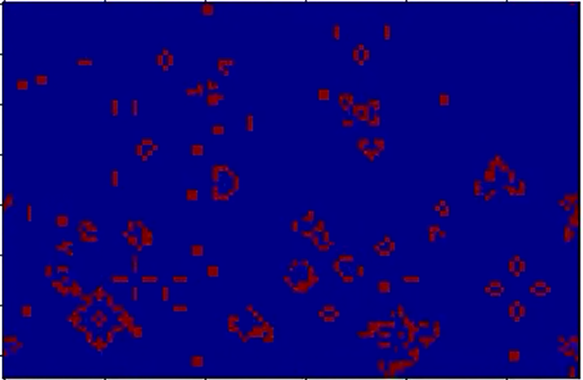

This learning module accompanies chapter 10 Angela B. and George W Shiflet's
book [Introduction to Computational Science](https://ics.wofford-ecs.org/).  This
learning module studies cellular automaton (CA) simulations.  The code in this module
uses object oriented methods.  Most of the CA code uses inheritance
from NumPy arrays for much of the functionality.

In this folder are:
- [CA NumPy Inheritance](CA_NumPy_Inheritance.ipynb) which explains the CA simulation
object which inherits NumPy arrays.  The document contains several
[Game of Life](http://web.stanford.edu/~cdebs/GameOfLife/) example simulations.
This is the introductory document for this learning module.  This document also lists
some suggested resources for understanding classes, inheritance and NumPy arrays.
 - [CA List of Objects](CA_List_of_Objects.ipynb) which gives implements the same
 examples as the above document, but this document does not use NumPy arrays.
 Instead it uses a custom class which implements an indvidual cell.
 - [Cellular Automaton Python Code](CellularAutomaton.py) for base CA code.  This
 file includes both the NumPy inheritance version and the Cell object version.
 - [Notebook](CA_Heat_Diffusion.ipynb) demonstrating 2D heat transfer simulation 
 using CA methods.  This simulation inherits cellular automaton functionality from
 CAGrid through inheritance.
 - [Heat Transfer Code](HTGrid.py) to support the above notebook.
 - [Assignments Folder](Assignments) needs to be populated with assignments.
 